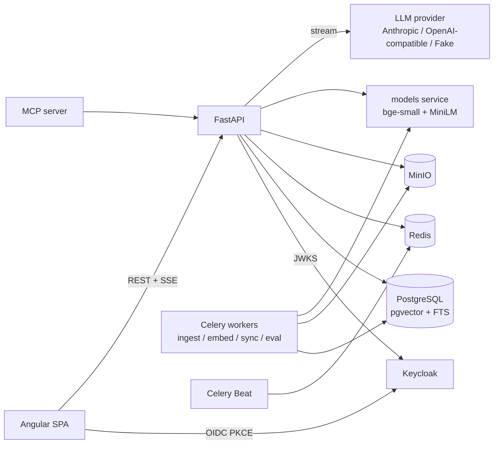

# Knowledge RAG Platform
A permission-aware knowledge base with an AI assistant: hybrid search, answers with page-level citations, document-level access from SSO groups, and an evaluation harness that measures retrieval and answer quality.

  

**Demo users** (Keycloak, password `demo`): `alice` (engineering), `bob` (sales), `carol` (finance), `admin` (kb-admins).

## Why this project
Most "chat with your PDFs" demos let everyone see everything, guess when they don't know and can't tell you whether yesterday's change made answers better or worse. This one treats retrieval like a production system: access control is applied **before** ranking, every answer cites the page it came from, the assistant says "not in your documents" instead of inventing, and every retrieval change is scored against a 91-question golden set.

## Highlights
- **Permission-aware retrieval.** Allowed collections are computed from the token's groups, cached in Redis with versioned invalidation, and pushed into the SQL of both the vector and the full-text query (pgvector `hnsw.iterative_scan`). Leakage is measured by an independent oracle and is a hard gate: **0 leaks on all 91 questions**.
- **Hybrid search, each step measured.** pgvector + Postgres FTS → Reciprocal Rank Fusion → cross-encoder rerank → MMR (max 3 chunks per document). The experiment table below shows what each step bought.
- **Citations that open the source.** `[n]` chips link to the chunk; the PDF viewer opens on the cited page and highlights the passage.
- **Honest "I don't know".** The rerank score has a calibrated 0–1 scale; the no-answer threshold τ = 0.10 was chosen on the unanswerable and permission questions (no-answer accuracy 93.3%). Unanswered questions are clustered for admins ("which documents are missing").
- **Incremental indexing.** Document and chunk content hashes: unchanged documents are skipped, unchanged chunks keep their embeddings, the swap happens in one transaction. Killing a Celery worker mid-ingest is a test, not an incident.
- **Documents are untrusted input.** The corpus contains a prompt-injection page; sources are fenced as data and guardrails drop injected sentences, foreign URLs and bogus citations (tested with an "obedient" fake model).
- **English and Ukrainian UI.** `@angular/localize` with runtime translations and a persisted language switcher (the Keycloak login page follows it); lint fails on any untranslated visible string and tests check both catalogs are complete.
- **Fast where it matters.** Lighthouse on the built app: accessibility, best practices and SEO 100 on every page, performance 94–98 on desktop (63 on simulated slow-4G mobile).
- **Observable.** Every question has a trace (ACL, embed, vector, lexical, rerank, first token, total; all candidate scores; the final prompt) plus Prometheus metrics, OpenTelemetry spans and a Grafana dashboard.

## Architecture



Uploads go straight from the browser to MinIO with a presigned PUT; the API registers the file and a Celery task parses it (PyMuPDF with header/footer removal, python-docx, markdown-it, trafilatura), chunks it by structure, and embeds only new chunks on a separate `embed` queue. Status changes are published on Redis and streamed to the UI over SSE. A question goes through ACL → condense (follow-ups) → hybrid retrieval → rerank → threshold → streamed generation → citation post-processing, and everything is written to `query_logs`.

## Tech stack
| Layer | Technology | Why |
|---|---|---|
| API | Python 3.13, FastAPI, Pydantic v2, SQLAlchemy 2 async + asyncpg, Alembic | Typed, async, OpenAPI-first (the Angular client is generated) |
| Search | PostgreSQL + pgvector (HNSW, per-model partial expression index) + FTS | ACL filter, vectors and text in one query and one transaction ([ADR 1](docs/adr/0001-pgvector-instead-of-a-vector-database.md)) |
| Jobs | Celery + Redis, Celery Beat | Queues per workload, acks-late + reject-on-worker-lost, schedules |
| Models | sentence-transformers `BAAI/bge-small-en-v1.5` (384 d), `cross-encoder/ms-marco-MiniLM-L-6-v2`, served by a small FastAPI `models` service | Free, deterministic, runs on a laptop CPU |
| LLM | `LlmClient` with Anthropic and OpenAI-compatible adapters, deterministic `FakeLlm` | Tests and demo need no key |
| Auth | Keycloak (OIDC, Authorization Code + PKCE), groups claim | Enterprise SSO scenario |
| Frontend | Angular 22 standalone + zoneless, signals, NgRx SignalStore, Material 3, ngx-markdown, ngx-extended-pdf-viewer, ngx-echarts | Modern Angular, lazy heavy features |
| Quality | uv, Ruff, mypy --strict, pytest + Hypothesis, Vitest, Playwright, Storybook + test runner, Lighthouse | |
| Ops | OpenTelemetry, Prometheus, Grafana, Locust, Docker Compose | |

## Getting started
```sh
docker compose up --build            # postgres, redis, minio, keycloak, models, api, worker, beat, web, prometheus, grafana, jaeger
open http://localhost:4421           # log in as alice / demo
```
Without Docker (what the author's machine uses): start Postgres 16+ with pgvector, Redis and MinIO, then
```sh
make install && make keycloak && make models   # Keycloak on :4480, models on :4410
make seed                                      # migrate + index the 61-document Northwind corpus
make api worker beat web                       # API :4400, Angular dev server :4420
```
An MCP server (`kb-mcp`, tools `search_knowledge` and `get_document`) exposes the same permission-checked search to Claude Desktop, IDEs or agents: over stdio with `KB_MCP_TOKEN`, or over Streamable HTTP (`make mcp`, port 4430) where every client sends its own `Authorization: Bearer` token. An integration test drives it with the official MCP SDK client as two different users and checks that each sees only their own collections.

## Testing
| Suite | Command | What it covers |
|---|---|---|
| Unit | `make test-unit` | parsers on fixtures (a PDF with running headers and a table, a scanned PDF, DOCX, Markdown, HTML with navigation), chunker properties (Hypothesis), RRF/MMR/metrics, guardrails, fake LLM and judge, JWT validation incl. key rotation and algorithm confusion, web crawler (robots, sitemap, ETag, 404 → delete, rate limit) and Notion connector with mocked HTTP, MCP tools |
| Integration | `make test-integration` | real Postgres/pgvector, Redis, MinIO in throwaway databases: the user × collection × action ACL matrix, leakage across search modes and endpoints, pre-filter with iterative HNSW scan, presigned upload flow, incremental reindex, chat SSE contract, stop and client disconnect, prompt injection, analytics, eval runs, Celery worker killed mid-ingest |
| Eval | `make eval`, `make eval-gate` | golden set on the real corpus, gate recall@8 ≥ 0.85 and leakage = 0 |
| Frontend | `cd frontend && npm test` | stores, SSE parser, interceptors, guards, pipes, components, i18n catalogs and language switching |
| Storybook | `make storybook-test` | stories with play functions for the shared UI components, run by the Storybook test runner against the static build |
| E2E | `make e2e` | Playwright against real Keycloak: upload → ready → cited answer → PDF at the page; Bob vs Carol; admin runs an eval; switching to Ukrainian survives a reload |
| Lighthouse | `make lighthouse` | logs in through Keycloak and audits five pages on desktop and the chat on mobile; reports in [`docs/lighthouse/`](docs/lighthouse/) |
| Smoke | `make smoke` | starts the whole stack and exercises every main flow end to end |

## Evaluation
Golden set: 91 questions (27 factoid, 12 table, 12 exact-term, 7 multi-hop, 6 follow-up, 3 conflicting, 2 prompt-injection, 12 permission, 10 unanswerable) over 61 synthetic Northwind documents in PDF, DOCX, Markdown and HTML, 4 users with different groups. Current default (hybrid + rerank of the top 20 fused candidates, fresh index): recall@8 99.3%, MRR 0.968, leakage 0, no-answer accuracy 94.5%, retrieval p95 0.67 s. The experiment table below was measured on 2026-10-02 (89 questions, 60 documents, 30 rerank candidates) on an Apple M1 (8 GB, CPU only) with the local models and the deterministic fake LLM/judge; each row is a separately built index.

| Configuration | Recall@5 | Recall@8 | MRR | nDCG@8 | exact_term R@8 | No-answer acc. | Faithfulness | Correctness | p95 latency (retrieval) | p95 latency (answer) |
|---|---|---|---|---|---|---|---|---|---|---|
| Vector only, chunk 800 | 91.8% | 94.8% | 0.867 | 0.873 | 100.0% | 80.9% | 99.5% | 3.403 | 58.290 ms | 54.870 ms |
| Vector only, chunk 450 | 91.8% | 94.8% | 0.859 | 0.870 | 100.0% | 80.9% | 99.5% | 3.403 | 121.580 ms | 74.530 ms |
| + contextual prefix | 95.5% | 95.5% | 0.945 | 0.934 | 100.0% | 79.8% | 100.0% | 3.582 | 84.820 ms | 69.330 ms |
| + lexical (hybrid RRF) | 98.5% | 98.5% | 0.943 | 0.942 | 100.0% | 79.8% | 99.5% | 3.448 | 82.980 ms | 57.050 ms |
| + reranker | 97.0% | 98.5% | 0.967 | 0.957 | 100.0% | 93.3% | 99.5% | 3.597 | 2673.300 ms | 1965.280 ms |

What each row shows:
- **chunk 800 vs 450:** the corpus documents are short and heading-dense, so structural chunking produces almost the same chunks (575 vs 578); chunk size barely matters here — a result in itself.
- **+ contextual prefix** (title > section prepended to the embedding input only) raised MRR from 0.86 to 0.95 and recall@8 from 94.8% to 95.5%: chunks that say "the limit is $1,200" now carry *which* policy they belong to.
- **+ lexical (hybrid RRF)** lifted recall@5 and recall@8 to 98.5% (multi-hop and table questions that name specific terms).
- **+ reranker** adds the best ranking (MRR 0.967, nDCG 0.957) and, more importantly, a calibrated score: no-answer accuracy goes from ~80% to 93.3% because τ can be tuned on it. Its cost is CPU time (see latency; the p95 column for this row was measured while the machine was also building the frontend).
- Leakage was 0 for every configuration; faithfulness/correctness come from a deterministic fake judge (key-fact matching and claim support) because no LLM key is configured here — they compare configurations, not absolute answer quality. Set `KB_ANTHROPIC_API_KEY` and run `kb-eval run --mode full --llm-provider anthropic --judge-provider anthropic` for an LLM-judged run.

## Performance
Locust, 50 concurrent chat users (think time 1–3 s; tasks chat : search : list = 5 : 2 : 1), 90 s per run, FakeLlm streaming with 15 ms per token, one uvicorn process, Postgres 16 + pgvector 0.8 and the models service on the same Apple M1 laptop (8 GB, CPU only), measured 2026-10-02 while other projects were also running on the machine. Raw CSV/HTML in [`docs/benchmarks/`](docs/benchmarks/), script `scripts/loadtest.sh`.

| Run | Change | Requests | Failures | Chat first token p50 / p95 | Search p50 / p95 | Throughput |
|---|---|---|---|---|---|---|
| A | baseline: rerank 30 candidates, one inference queue for embed + rerank | 222 | 0 | 38.0 s / 52.0 s | 39.0 s / 53.0 s | 2.5 req/s |
| B | separate embed and rerank queues | 175 | 29 (timeouts to models → 500) | 27.0 s / 49.0 s | 35.0 s / 60.0 s | 2.0 req/s |
| C | + rerank only the top 12 fused candidates | 437 | 0 | 17.0 s / 22.0 s | 17.0 s / 21.0 s | 4.9 req/s |
| D | + 8 s rerank deadline with graceful fallback to RRF order | 724 | 0 | 8.9 s / 10.0 s | 8.4 s / 9.7 s | 8.1 req/s |

Mean step time under load (run A → run D): ACL 3 → 6 ms, query embedding 12.8 s → 87 ms, vector 14 → 188 ms, lexical 31 → 169 ms, **rerank 22.4 s → 7.6 s**. What the numbers say:
- The database is not the bottleneck at this load: vector + lexical search stay in the tens to low hundreds of milliseconds even at 8 req/s, so neither the connection pool (10 + 10) nor `hnsw.ef_search = 100` limited throughput.
- The CPU cross-encoder is. In run A query embeddings (≈10 ms of work) waited behind reranks in a shared queue; splitting the queues removed that, but more parallel reranks on a 4-performance-core CPU slowed each one until the API's 60 s client timeout fired (run B) — which is why the deadline + fallback exists.
- Reranking 12 instead of 30 candidates roughly doubles throughput and did not hurt quality on the golden set. A later sweep on a fresh index (`scripts/eval-sweep.sh`, 91 questions) set the default to 20:

| `KB_FUSED_TOP_K` | Recall@8 | MRR | nDCG@8 | No-answer acc. | p95 retrieval (single user) |
|---|---|---|---|---|---|
| 12 | 98.6% | 0.972 | 0.962 | 94.5% | 365 ms |
| **20 (default)** | 100.0% | 0.968 | 0.966 | 94.5% | 611 ms |
| 30 | 99.3% | 0.968 | 0.962 | 93.4% | 1013 ms |
| 50 | 98.6% | 0.968 | 0.958 | 93.4% | 1619 ms |

  20 is as good as 30 on every metric at 40% lower latency. The gaps between 12, 20 and 30 are one or two questions, about the noise between two fresh index builds, so latency decides; `KB_FUSED_TOP_K=12` remains the setting for heavy load on CPU.
- With a GPU or a hosted reranker the same code path would be bounded by the LLM, not retrieval.

## Lighthouse
Built app served locally with compression, logged in as a real Keycloak user, Lighthouse 13 (2026-10-05); full reports in [`docs/lighthouse/`](docs/lighthouse/).

| Page | Device | Performance | Accessibility | Best practices | SEO | LCP |
|---|---|---|---|---|---|---|
| Chat | desktop | 94 | 100 | 100 | 100 | 1.37 s |
| Search | desktop | 95 | 100 | 100 | 100 | 1.30 s |
| Collections | desktop | 97 | 100 | 100 | 100 | 1.24 s |
| Admin overview | desktop | 95 | 100 | 100 | 100 | 1.20 s |
| Chat (Ukrainian) | desktop | 98 | 100 | 100 | 100 | 1.11 s |
| Chat | mobile (slow 4G) | 63 | 100 | 100 | 100 | 7.05 s |

The first run found uncompressed JavaScript from the preview server, the full echarts bundle on the admin page and fonts loaded from Google; fixing those raised desktop performance from 74–87 to 94–98. Mobile is still bounded by the sign-in chain (HTML → JS → config → OIDC discovery → API) and an icon font that is not subset.

## Architecture decisions
1. [pgvector instead of a vector database](docs/adr/0001-pgvector-instead-of-a-vector-database.md)
2. [ACL pre-filtering](docs/adr/0002-acl-pre-filtering.md)
3. [Hybrid search with RRF](docs/adr/0003-hybrid-search-with-rrf.md)
4. [Cross-encoder reranker](docs/adr/0004-cross-encoder-reranker.md)
5. [Structural chunking](docs/adr/0005-structural-chunking.md)
6. [Celery with Redis](docs/adr/0006-celery-with-redis.md)
7. [OIDC with Keycloak](docs/adr/0007-oidc-with-keycloak.md)
8. [Angular SPA without SSR](docs/adr/0008-angular-spa-without-ssr.md)
9. [Eval with hard thresholds](docs/adr/0009-eval-with-hard-thresholds.md)
10. [Provider abstractions and local models](docs/adr/0010-provider-abstractions-and-local-models.md)
11. [Incremental indexing by hashes](docs/adr/0011-incremental-indexing-by-hashes.md)
12. [Documents are untrusted input](docs/adr/0012-documents-are-untrusted-input.md)

## Known limitations & next steps
- No OCR: scanned PDFs are rejected with `no_text_layer`.
- Permissions are per collection; there are no document-level overrides.
- The corpus is synthetic and small (61 documents, ~590 chunks); numbers on a real intranet will differ.
- The LLM judge is an approximation, and here it is a deterministic fake; answer-quality numbers need a real judge run.
- Changing a collection's embedding model reindexes with a short gap in vector search for that collection; the zero-downtime path (second embedding column + atomic switch) is designed but not built.
- The reranker dominates latency on CPU; production would use a GPU, a smaller candidate set or an API reranker.
- Mobile Lighthouse performance is 63; subsetting the Material Symbols font and trimming the pre-render request chain are the next steps.
- Prompt-injection defence is heuristic (fencing + output checks), not a guarantee.
- CI workflows, PR comments, deployment and the demo video are not part of this repository; the eval CLI prints the markdown table a PR comment would contain.
