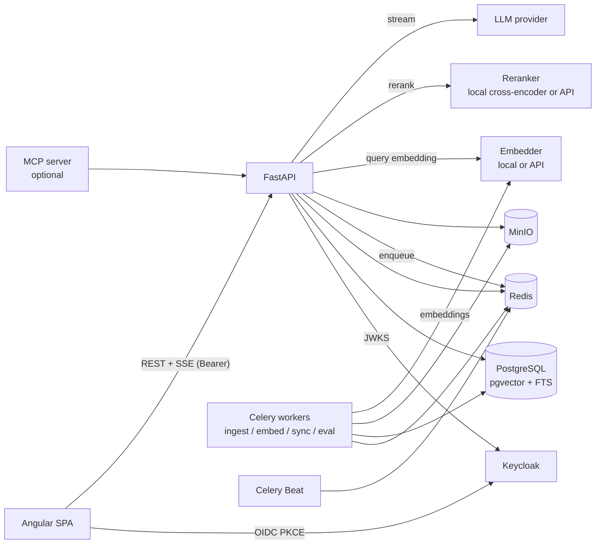

# ARCHITECTURE

## Схема



## Компоненты

| Компонент | Ответственность |
|---|---|
| `api` (FastAPI) | Auth (валидация OIDC-токенов), коллекции, документы, ACL, поиск, чат (SSE-стриминг), фидбэк, админ-аналитика, eval-результаты, presigned upload |
| `worker` (Celery) | Очереди: `ingest` (парсинг и чанкинг), `embed` (батчи embeddings, отдельная очередь, так как нужно много CPU/GPU или лимиты API), `sync` (веб-краулер и коннекторы), `eval` (прогоны оценки) |
| `beat` | Расписание синхронизаций источников, очистка, пересчёт аналитики |
| `models` (опционально) | Отдельный контейнер с локальными моделями embeddings/reranker (TEI или свой FastAPI на sentence-transformers), чтобы API не держал модели в памяти |
| `web` (Angular) | SPA, раздаётся nginx; SSR не нужен (внутренний инструмент, SEO не нужен — ADR) |
| `keycloak` | Realm `northwind`, клиент `kb-web` (public, PKCE), группы, демо-пользователи; экспорт realm в репозитории |

## Структура репозитория

```text
knowledge-rag-platform/
├── backend/
│   ├── pyproject.toml            # uv, ruff, mypy, pytest конфиги
│   ├── alembic/
│   ├── src/kb/
│   │   ├── main.py               # create_app(), lifespan, middlewares
│   │   ├── config.py             # pydantic-settings
│   │   ├── core/                 # db session, security (OIDC/JWKS), errors (problem+json), telemetry, pagination
│   │   ├── auth/                 # Principal, получение групп, зависимости FastAPI
│   │   ├── collections/          # router, service, repository, schemas
│   │   ├── documents/
│   │   ├── access/               # ACL: вычисление доступных коллекций, проверки
│   │   ├── ingestion/            # parsers/, chunking/, pipeline.py, hashing.py
│   │   ├── connectors/           # upload, web_crawler, notion (опционально) — общий интерфейс Connector
│   │   ├── retrieval/            # vector.py, lexical.py, fusion.py (RRF), rerank.py, retriever.py
│   │   ├── generation/           # prompts/, llm_client.py, answerer.py, citations.py, guardrails.py
│   │   ├── chat/                 # conversations, messages, SSE endpoint
│   │   ├── feedback/
│   │   ├── analytics/
│   │   ├── evaluation/           # datasets, metrics, runner, judge
│   │   ├── providers/            # embedders/, rerankers/, llms/ — реализации + fakes
│   │   ├── workers/              # celery_app.py, tasks/*
│   │   └── mcp/                  # (опционально) MCP-сервер поверх retrieval
│   └── tests/
│       ├── unit/
│       ├── integration/          # testcontainers: postgres+pgvector, redis, minio
│       └── eval/                 # golden dataset + пороги качества
├── frontend/                     # Angular workspace
├── eval-data/
│   ├── corpus/                   # документы Northwind (PDF/DOCX/MD/HTML)
│   └── golden.jsonl              # вопросы, эталонные ответы, ожидаемые документы/страницы, пользователь
├── infra/
│   ├── docker-compose.yml
│   ├── keycloak/realm-northwind.json
│   └── grafana/
└── docs/
```

Слои внутри модуля: `router` (HTTP) → `service` (use cases, транзакции) → `repository` (SQLAlchemy). Pydantic-схемы отделены от ORM-моделей. Зависимости через `Depends` + фабрики, без глобальных синглтонов (кроме engine и клиентов в `lifespan`).

## Ключевые потоки

### Загрузка документа

```text
UI → POST /collections/{id}/documents/upload-url → presigned PUT (MinIO)
UI → PUT файл напрямую в MinIO (прогресс в UI)
UI → POST /collections/{id}/documents {storage_key, filename} → document(status=queued)
API → celery ingest.document(document_id)
worker: скачать → определить тип → парсинг → нормализация → chunking → хэши
        → diff с существующими чанками → новые/изменённые → очередь embed (батчи 64)
        → статусы: parsing → chunking → embedding → ready | failed(error)
UI ← SSE /documents/events (статусы в реальном времени через Redis pub/sub)
```

### Вопрос в чате

```text
UI → POST /chat/conversations/{id}/messages {content}  (Accept: text/event-stream)
API:
  1. principal → доступные collection_ids (кэш в Redis 60 сек, ключ = sub + версия групп)
  2. если есть история → condense: переформулировать вопрос в самостоятельный (дешёвая модель)
  3. retrieve: vector top-40 ∥ lexical top-40 (с фильтром по коллекциям) → RRF → top-30 → rerank → top-8
  4. если max rerank score < порога → ответ «нет информации», event: no_answer
  5. generate (стрим): SSE events: meta{retrieval}, token…, citations{…}, done{usage, latency}
  6. post-check цитат, запись query_log (чанки, скоры, тайминги шагов, токены, стоимость)
UI рендерит токены по мере прихода, после done — кликабельные цитаты
```

## Решения (ADR)

| # | Решение | Альтернатива | Почему |
|---|---|---|---|
| 1 | pgvector вместо отдельной векторной БД | Qdrant, Weaviate | Фильтр по ACL, FTS и вектор в одной транзакции и одном запросе; объём < 1M чанков |
| 2 | **Pre-filtering по ACL** (в SQL до ранжирования) | Post-filter после top-k | Post-filter может вернуть 0 результатов или «протечь» при ошибке. Pre-filter + итеративный HNSW-скан pgvector (`hnsw.iterative_scan`) |
| 3 | Гибридный поиск + RRF | Только вектор | Вектор плохо находит точные термины (коды, имена, номера политик). Выбор подтверждён eval-таблицей |
| 4 | Cross-encoder reranker | Без reranker, LLM-reranking | Заметный прирост качества за ~50–150 мс. Замерено |
| 5 | Chunking по структуре документа (заголовки, страницы) с лимитом токенов | Фиксированные окна | Чанки не режут мысль, есть `heading_path` для контекста и цитат |
| 6 | Celery + Redis | arq, Dramatiq, RQ | Самый распространённый в вакансиях, ретраи, роутинг по очередям, beat. Минус — тяжеловат и не async-native |
| 7 | OIDC через Keycloak | Своя auth | Реалистичный enterprise-сценарий, группы из IdP; своя auth — не то, что нужно показывать в этом проекте |
| 8 | Angular SPA без SSR | Angular SSR | Внутренний инструмент за логином, SEO не нужно |
| 9 | Eval в CI с жёсткими порогами | Ручная проверка | Регрессии качества ловятся так же, как регрессии кода |
| 10 | Абстракции провайдеров + локальные модели в CI | Только API | Детерминированность, бесплатный CI, нет утечки данных |
| 11 | Инкрементальная индексация по хэшам чанков | Полная переиндексация | Экономия на embeddings, быстрые синхронизации |
| 12 | Документы как недоверенные данные в промпте | — | Защита от prompt injection через контент |

## Безопасность

- JWT валидируется по JWKS (кэш ключей, ротация), проверяются `iss`, `aud`, `exp`.
- Каждая выдача чанка проходит через ACL: и в поиске, и в `GET /chunks/{id}`, и в превью документа, и в presigned download URL (короткий TTL, генерируется только после проверки прав).
- Контент документов в промпте в явных разделителях + инструкция не выполнять команды из них; ответ проверяется на ссылки и URL, отсутствующие в источниках.
- Rate limit на чат (на пользователя) и дневной лимит токенов.
- Загрузка файлов: проверка MIME по содержимому (`python-magic`), лимит размера, запрет исполняемых типов.
- Логи не содержат текст вопросов в проде (конфиг). В демо — содержат, чтобы показать аналитику.
